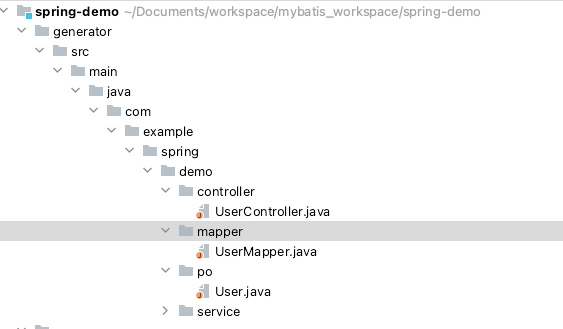

# 技术栈
springboot、mybatis-plus、logback

# 持久层代码生成
修改执行GeneratorMain对应数据库连接，执行GeneratorMain的main方法，选择对应表生成，生成完成会保存在工程的generator文件夹下


# 日志
日志默认保存在/data/web_log/java/spring-demo下，如果需要替换修改logback-spring.xml文件对应内容即可。

# 配置
系统的配置都在application.properties文件中，例如端口、数据库连接

# 测试
编写好的接口，可以通过test.http进行调用测试，具体如下图，示例中请求user/selectList接口


# 系统部署
## 打包
执行以下命令会在target下产生可部署的jar包spring-demo-0.0.1-SNAPSHOT.jar
```shell
mvn clean -DskipTests=true package
```


## 部署
复制spring-demo-0.0.1-SNAPSHOT.jar，执行以下命令进行控制台启动
```shell
java -jar spring-demo-0.0.1-SNAPSHOT.jar
```
后台启动
```shell
nohup java -jar spring-demo-0.0.1-SNAPSHOT.jar &

```
