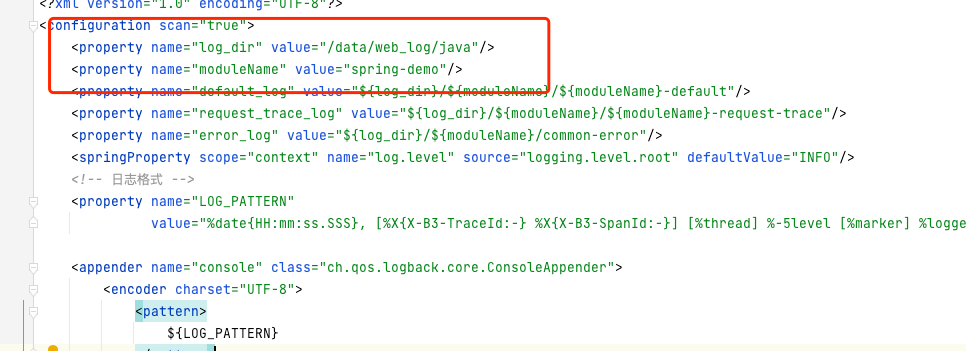
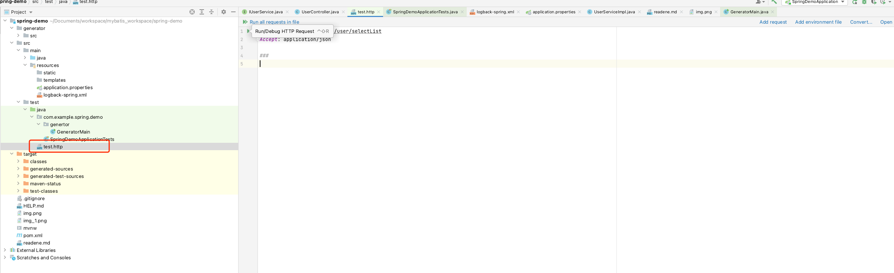
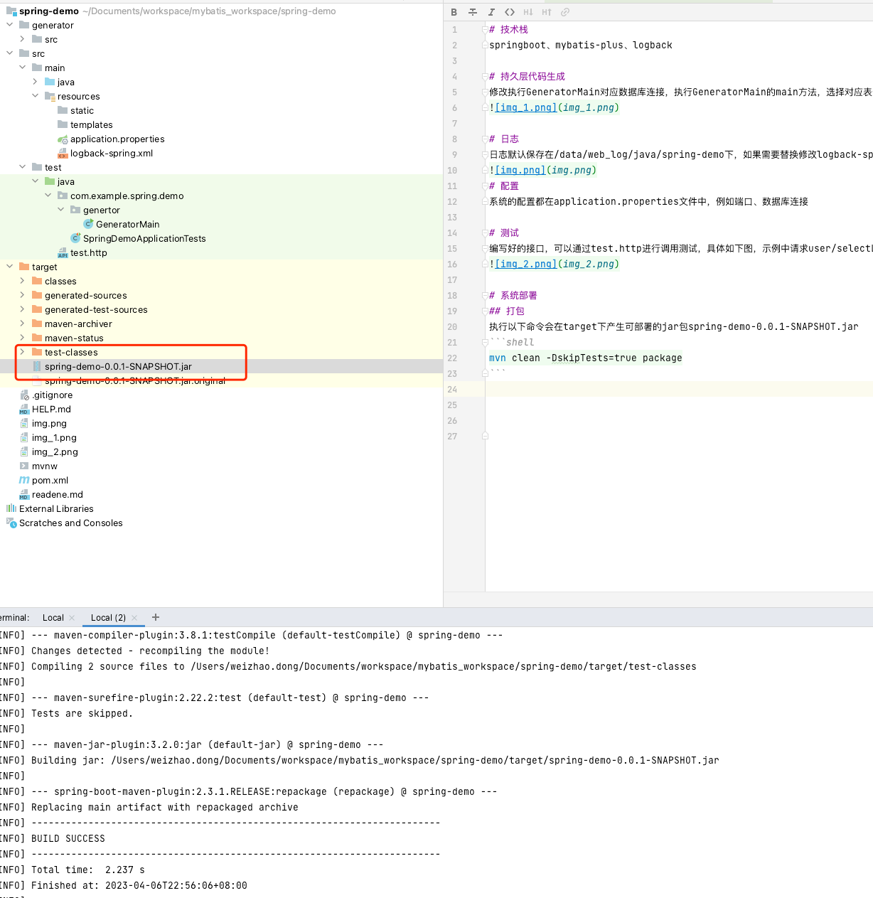
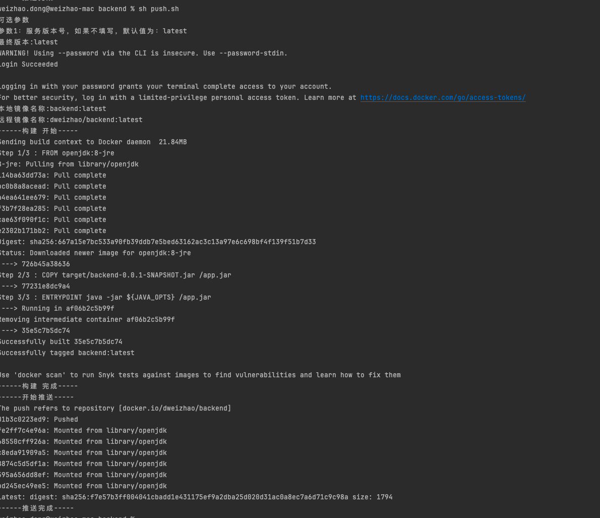

# 技术栈
springboot、logback

# 日志
日志默认保存在/data/web_log/java/backend下，如果需要替换修改logback-spring.xml文件对应内容即可。

# 配置
系统的配置都在application.properties文件中，例如端口、数据库连接

# 测试
编写好的接口，可以通过test.http进行调用测试，具体如下图，示例中请求user/selectList接口


# 系统部署
## 打包
执行以下命令会在target下产生可部署的jar包backend-0.0.1-SNAPSHOT.jar
```shell
sh package.sh
```


## 部署
复制backend-0.0.1-SNAPSHOT.jar，执行以下命令进行控制台启动
```shell
java -jar backend-0.0.1-SNAPSHOT.jar
```
后台启动
```shell
nohup java -jar backend-0.0.1-SNAPSHOT.jar &

```
## docker镜像打包
执行`push.sh`默认会从环境变量读取dockerhu的用户名`$docker_hub_uname`和密码`$docker_hub_pwd`，请进行设置，并修改镜像仓库地址为使用者自己的地址
```
sh push.sh
```

